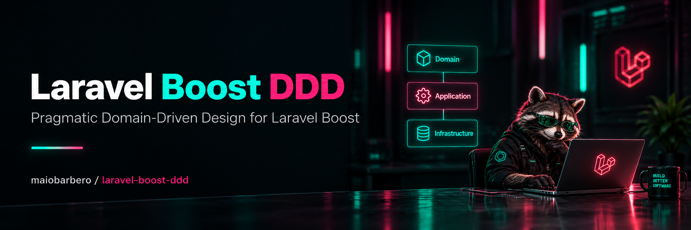

# Laravel Boost DDD
**Pragmatic, Laravel-native Domain-Driven Design for Laravel Boost.**

<p align="center">
  <a href="https://github.com/maiobarbero/laravel-boost-ddd/"></a>
  <a href="https://packagist.org/packages/maiobarbero/laravel-boost-ddd"></a>
  <a href="https://packagist.org/packages/maiobarbero/laravel-boost-ddd"></a>
  <a href="https://packagist.org/packages/maiobarbero/laravel-boost-ddd"></a>
  <a href="https://github.com/laravel/boost"></a>
</p>

Laravel Boost DDD teaches your coding agents how to apply Domain-Driven Design without fighting Laravel.

It provides Laravel Boost with opinionated guidelines, 11 task-specific agent skills, and Pest architecture tests so that feature work consistently follows the same architectural boundaries.

The goal is not to turn every Laravel application into enterprise architecture. The goal is to give business complexity a clear place to live.

The approach keeps Eloquent, policies, events, queues, and Laravel's usual entry points. Business behavior belongs in Domain, use cases belong in Application, and external integrations belong in Infrastructure. Repositories, Data objects, and services are introduced only when the work gives them a purpose.

Adoption happens as you work on the application. New capabilities follow the DDD structure; **existing code stays where it is until a migration is part of the task**. Installing the package gives the agent that direction for feature work, bug fixes, and refactoring. It does not move application code or authorize a wider rewrite.

## What does it change?

Without architectural guidance, a coding agent can easily put authorisation, business rules, database writes, external APIs, and event dispatching into the same controller or service.

Laravel Boost DDD gives the agent a shared set of decisions for where that code belongs.

For example, a request to:

> Add the ability for a customer to cancel an order.

might result in:
```
app/
├── Application/
│   └── Orders/
│       └── Actions/
│           └── CancelOrder.php
│
├── Domain/
│   └── Orders/
│       ├── Models/
│       │   └── Order.php
│       └── Events/
│           └── OrderCancelled.php
│
└── Http/
    └── Controllers/
        └── CancelOrderController.php
```

## Installation

The package requires PHP `^8.3`, Laravel's Illuminate Support `^12.0|^13.0`, and Laravel Boost `^2.9`. Composer resolves the compatible versions and installs Boost if it is missing. Pest must also be available in the application, because the installer checks for it before making changes.

From your Laravel application's root, install the package as a development dependency:

```sh
composer require --dev maiobarbero/laravel-boost-ddd
```

If the application does not already use Pest, add it as a development dependency and initialize its test setup before continuing:

```sh
composer require --dev pestphp/pest
vendor/bin/pest --init
```

Then run the package installer:

```sh
php artisan boost-ddd:install
```

The command adds `maiobarbero/laravel-boost-ddd` to Boost's configured packages, retaining the existing package selections. It calls Boost's installer with guidelines and skills enabled, then publishes `tests/Architecture/DddArchitectureTest.php` without forcing an overwrite of an existing file.

If Boost already has agents configured, the command reuses them without prompting. Otherwise, follow Boost's prompts to choose your agents, keeping this package selected. The command does not enable Boost's Model Context Protocol (MCP) server configuration; if you also need those tools, configure them separately with `php artisan boost:install --mcp`.

### Run the architecture tests

```sh
vendor/bin/pest tests/Architecture
```

The installer publishes the test file, but does not edit your PHPUnit configuration. If `phpunit.xml` or `phpunit.xml.dist` only includes Unit and Feature suites, add this inside `<testsuites>` so the architecture checks run with the rest of your tests:

```xml
<testsuite name="Architecture">
    <directory>tests/Architecture</directory>
</testsuite>
```

Checks for absent layers or directories are skipped. This is expected in an application that has not yet introduced `App\Domain` or `App\Application`. Once code enters those namespaces, it is covered by the rules. Legacy code elsewhere remains outside that scope.

## How the code is organized

The guidelines organize business code by capability, such as Orders or Billing. A capability folder does not automatically represent a separate bounded context; capabilities within the same context can collaborate directly.

| Location | Responsibility |
| --- | --- |
| `App\Domain\<Capability>` | Business behavior, invariants, value objects, domain exceptions, and events describing business facts. |
| `App\Application\<Capability>\Actions` | Use-case authorization, orchestration, persistence, transactions, and event dispatch coordination. |
| `App\Application\<Capability>\Data` | Structured use-case input when it is useful, independent of HTTP. |
| Domain or Application `Contracts` | Interfaces owned by the code that needs an external capability. |
| `App\Infrastructure` | External integrations, specialized persistence, and adapters for legacy workflows. |
| Laravel's usual directories | Controllers, commands, jobs, listeners, policies, providers, migrations, and test factories. |

As an example: order's `cancel()` method checks whether cancellation is allowed and changes its state. The `CancelOrder` Action authorizes the actor, invokes that behavior, and saves the model. If cancellation also writes an audit record, the Action owns the transaction that keeps the writes together. Application coordinates event dispatch so external reactions happen after commit.

That division also defines the dependency boundaries. Domain does not depend on Application, Infrastructure, or delivery code. Application does not depend on Infrastructure or delivery code. When either layer needs an outer dependency, it defines a contract, Infrastructure implements it, and a Laravel service provider binds the two. Container lookups and custom facades must respect the same boundaries.

Direct Eloquent persistence remains the default. A simple authorized read can stay in a controller; a scalar argument does not need a Data object around it. Jobs and listeners invoke Actions for meaningful use cases, while Actions prefer events for asynchronous follow-up work.

The [order cancellation example](resources/boost/skills/creating-action/references/order-cancellation.md) connects the model, Action, authorization, transaction, event, and tests. The full [core guidelines](resources/boost/guidelines/core.blade.php) describe the conventions agents receive.

## Included skills

The core guidelines establish the shared rules. The skills provide guidance for particular tasks, including changes to existing code. Whether a skill is selected depends on the agent and the task.

| Skill | Covers |
| --- | --- |
| `creating-action` | Use cases, authorization, persistence, and orchestration. |
| `creating-data` | Meaningful structured application input. |
| `creating-domain-model` | Business transitions and invariants on Eloquent entities. |
| `creating-value-object` | Immutable business values with their own rules and behavior. |
| `creating-domain-service` | Cohesive business rules without a natural entity or value-object owner. |
| `creating-domain-event` | Business facts and the timing of follow-up reactions. |
| `creating-integration` | Consumer-owned contracts and external or legacy adapters. |
| `introducing-repository` | Persistence abstractions when direct Eloquent is insufficient. |
| `using-laravel-entry-points` | Controllers, commands, jobs, and listeners that delegate business operations. |
| `testing-domain` | Invariants and state transitions tested directly. |
| `testing-action` | Use-case outcomes, authorization failures, rollback, and event timing. |

The published architecture test checks forbidden layer and transport dependencies, the presence of `handle()` on Actions, and the `Data` suffix on application Data classes. It does not prove authorization, transaction correctness, business behavior, public method visibility, or every dynamic dependency. Those still need behavioral tests and review.

## Installation for LLM agents

When asked to install this package in a Laravel application:

1. Read the application's instructions and inspect its Composer requirements, Pest setup, Boost configuration, and working-tree changes. Preserve existing configuration and unrelated work.
2. Run `composer require --dev maiobarbero/laravel-boost-ddd`. Ensure Pest is installed and initialized before running the package installer.
3. Check the `agents` array in `boost.json`. Reuse configured agents. For an unattended installation with no agents configured, add the intended agent's supported Boost identifier to that array, preserving other settings. Infer the choice only when the environment makes it clear; otherwise ask which agent to configure. The installer handles package registration itself.
4. Run the package installer. With agents configured, it reuses them without interaction:

   ```sh
   php artisan boost-ddd:install --no-interaction
   ```

5. Verify the generated agent instructions contain the DDD guidelines and that the configured agents supporting skills have access to all 11 skills and the order cancellation reference. Confirm `tests/Architecture/DddArchitectureTest.php` exists and is included in the normal test suite. If a copy already existed, compare it with the package stub and merge relevant changes.
6. Run `vendor/bin/pest tests/Architecture` and relevant existing behavioral tests. Report the actual results, including skipped checks for absent adopted layers and anything you could not verify.

Use `boost-ddd:install` for setup rather than reproducing its package registration and publishing steps manually. Apply the installed guidance to subsequent relevant work within the user's requested scope. Keep legacy code outside adopted namespaces until migration is in scope, and fix violations in adopted code without weakening the tests.

## Updates

```sh
composer update maiobarbero/laravel-boost-ddd
php artisan boost:update
```

Review the regenerated guidance and skills. The published architecture test belongs to your application: compare it with `vendor/maiobarbero/laravel-boost-ddd/stubs/tests/Architecture/DddArchitectureTest.php` and merge applicable changes. Re-running the installer does not force an overwrite of that file.

## License

[MIT](LICENSE)
